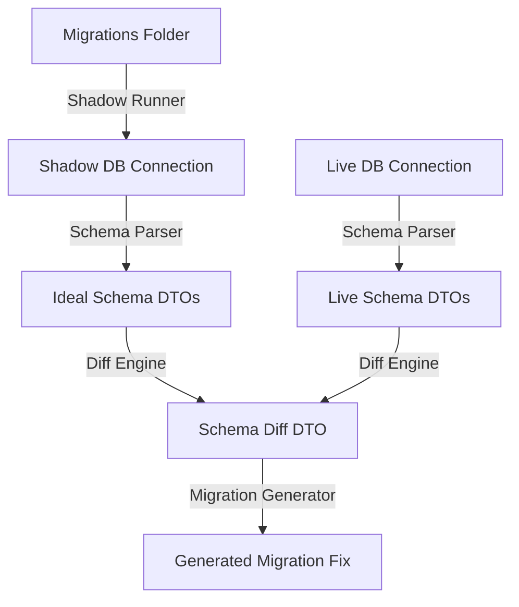

# Laravel Schema Sentinel: AI Agent Guidelines

Welcome, AI Coding Agent! This document outlines the architecture, coding standards, DTO structures, and testing guidelines for the `laravel-schema-sentinel` package. Read this to immediately acquire context.

---

## 🏗️ Architecture & Flow

The package follows a strictly decoupled architecture:
1. **Shadow Runner (`src/Core/ShadowMigrationRunner.php`)**: Simulates the execution of all migrations in an isolated, in-memory SQLite (or empty non-SQLite) database.
2. **Schema Parser (`src/Core/SchemaParser.php`)**: Parses the structures of both the Live database and the Shadow database into typed DTOs.
3. **Diff Engine (`src/Core/DiffEngine.php`)**: Analyzes the Table, Column, Index, and Foreign Key DTOs to detect discrepancies (Drift).
4. **Reverse Engineer (`src/Core/ReverseEngineer.php`)**: Translates database metadata back into fresh migrations, Eloquent models (with relations/casts), seeders, and PHP 8.4 Enums.
5. **Migration Generator (`src/Core/MigrationGenerator.php`)**: Generates valid Laravel Blueprint PHP migration code to fix the detected drift.



---

## 📂 Core DTOs (`src/DTOs/`)

*   **`TableDefinition`**: Holds a table's name, columns, indexes, and foreign keys.
*   **`ColumnDefinition`**: Represents type, nullability, default values, character length, unsigned status, and column comments.
*   **`IndexDefinition`**: Represents naming, columns covered, and index type (`primary`, `unique`, `index`, etc.).
*   **`ForeignKeyDefinition`**: Contains referencing columns, referenced columns, foreign table, and `onDelete`/`onUpdate` actions.

---

## 🎨 Development & Code Standards

1.  **Strict Types**: Every PHP file MUST begin with `declare(strict_types=1);` directly after the opening tag.
2.  **Explicit Param/Return Types**: Always declare explicit parameter and return types for all functions and methods. Do not use implicitly nullable types (e.g. use `?Type $param = null` instead of `Type $param = null`).
3.  **Command Attributes**: All command classes use modern attributes from `Illuminate\Console\Attributes`:
    *   `#[Signature('...')]`
    *   `#[Description('...')]`
4.  **File Length Limits**: Keep logic highly modular. Files should target a maximum length of under 200 lines where possible.
5.  **Programmatic APIs**: Extend functionality via the `Sentinel` facade (`Sentinel::check()`, `Sentinel::parse()`, `Sentinel::standardizeIndexes()`, `Sentinel::dataDrift()`, `Sentinel::reverse()`). Always update the Facade class docblock annotations in `src/Facades/Sentinel.php` when adding new methods.

---

## 🧪 Testing

We use PHPUnit. Run the full test suite using:
```bash
vendor/bin/phpunit
```
Feature and command test suites are located in `tests/Feature/`. Unit test cases reside in `tests/Unit/`.
